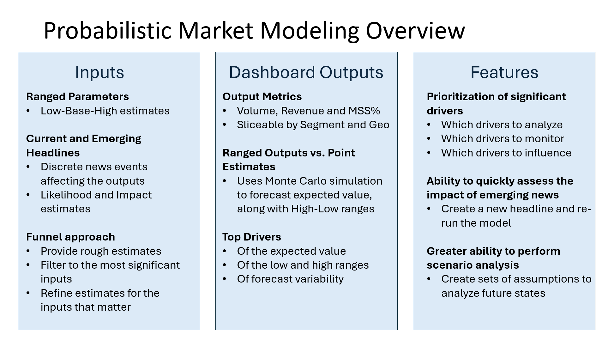
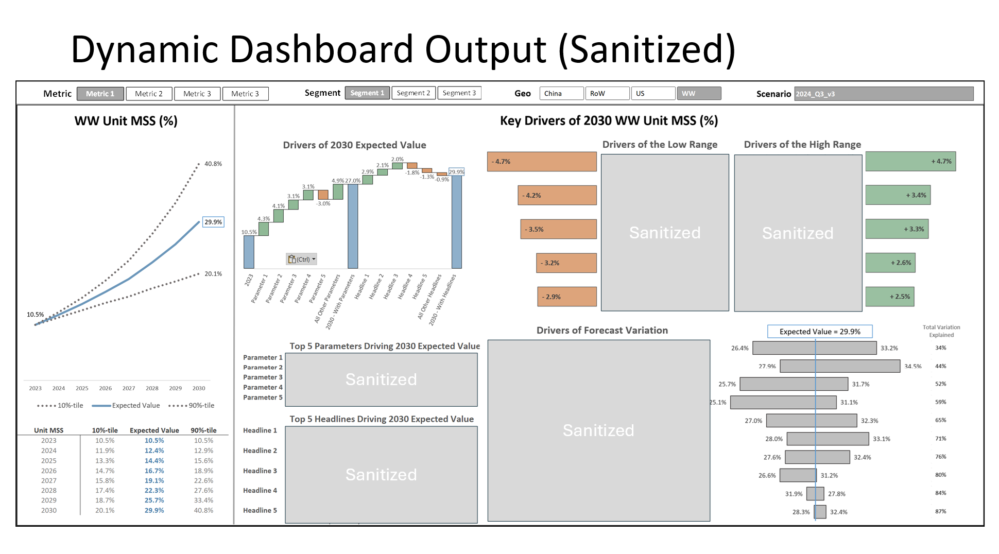

# Probabilistic Market Modeling Dashboard (Visual Showcase)

This project demonstrates a real-world probabilistic market model used to support strategic decisions under uncertainty. 

The original code and data are proprietary, but the following visuals illustrate the model’s inputs, structure, outputs, and dashboard analytics.

This project was built with Python, but this repository is intended as a visual showcase only. No source code is included due to confidentiality agreements.

---

## Overview

---

## Dashboard Output

