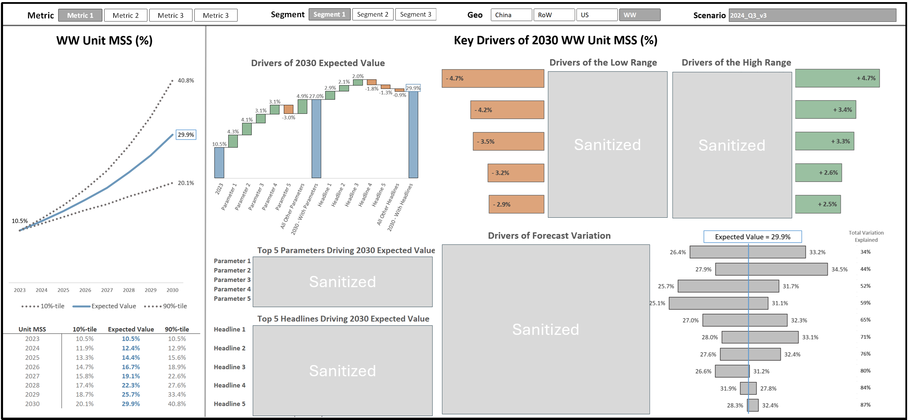

# Probabilistic Market Modeling Dashboard

This project showcases a real-world probabilistic market model used to support strategic decisions under uncertainty. The following visuals illustrate the model’s inputs, outputs, and dashboard analytics.

This project was built with Python, but the original code and data are proprietary. This repository is intended as a visual showcase only. No source code is included due to confidentiality agreements.

---

## Dynamic Dashboard

---

## Probabilistic Market Model Inputs / Outputs

